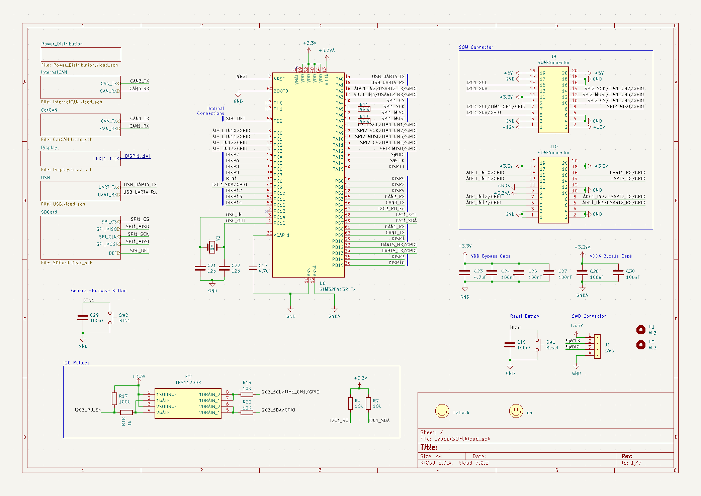
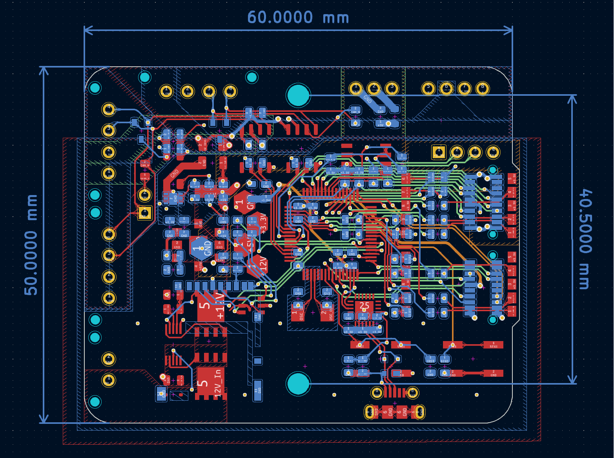

# LeaderSOM
Author: Pratyush Patra, Jacob Pustilnik, and Tianda Huang

This board is the Leader System-On-Module (SOM), a multifunction board with an STM32 MCU that is adaptible to the applications of each subsystem. The hardware and software on this board are responsible
for the processing, communication, and data collection tasks required for the car's subsystems.

## BOM
[**Interactive BOM (Must download and open in browser)**](bom/ibom.html)

[**Mouser Cart**]

## Connectors
| # | Name | Type | Ideal Voltage | Notes |
| J1 | SWD | PinHeader_1x04_P2.54mm_Vertical | - | - |
| J2 | USB_B_Micro | USB_Micro-B_Molex-105017-0001 | - | - |
| J4 | Micro_SD_Card_Det | microSD_HC_Hirose_DM3AT-SF-PEJM5 | - | - |
| J5 | CAN_In2 | Molex_MicroFit3.0_1x4xP3.00mm_PolarizingPeg_Vertical | - | - |
| J6 | CAN_Out2 | Molex_MicroFit3.0_1x4xP3.00mm_PolarizingPeg_Vertical | - | - |
| J7 | CarPowerConnector | Molex_MicroFit3.0_1x2xP3.00mm_PolarizingPeg_Vertical | - | - |
| J9 | SOMConnector | Molex_52465-2070 | - | - |
| J10 | SOMConnector | Molex_52465-2070 | - | - |
| J11 | CAN_Int | Molex_MicroFit3.0_1x4xP3.00mm_PolarizingPeg_Vertical | - | - |

## PCB

## Schematic

## Additional Notes
Below is a link to the pinout document for the board.
https://utexas.sharepoint.com/:x:/r/sites/ENGR-LonghornRacing/_layouts/15/Doc.aspx?sourcedoc=%7B1ce08b10-b376-4beb-83e4-bc72f106b36f%7D&action=edit&wdPreviousSession=fb9a9e6e-1c87-4462-82e8-13c90a4a025d

## Power Distribution
12V_In(from Car power connector) -> Power protection -> 12V+
12V+ -> DCDC Converter(Unisolated) -> 5V+
5V+ -> Capacitance Multiplier for filtering -> LDO -> 3.3V+

CAN Power(Internal CAN)-
5V+ -> Filtering and Regulator(Isolated) -> V_CAN+

CAN Power(CAR CAN)-
Need to design external board to interface with one of the LeaderSOM's to power our CarCAN

## Current Board Concerns(12.2.2023)
